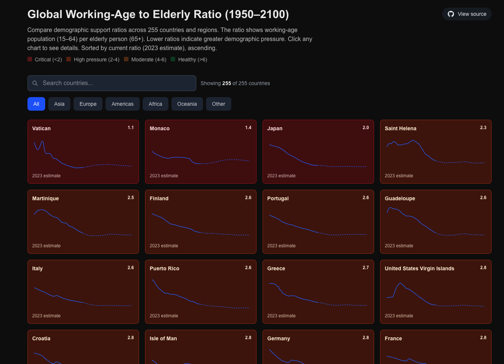
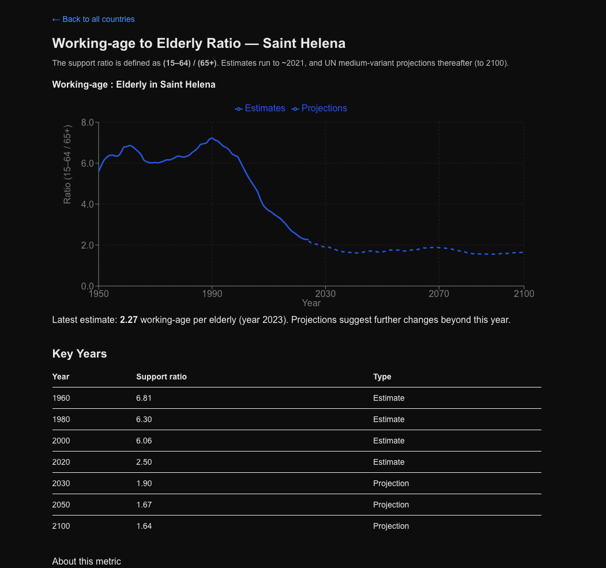
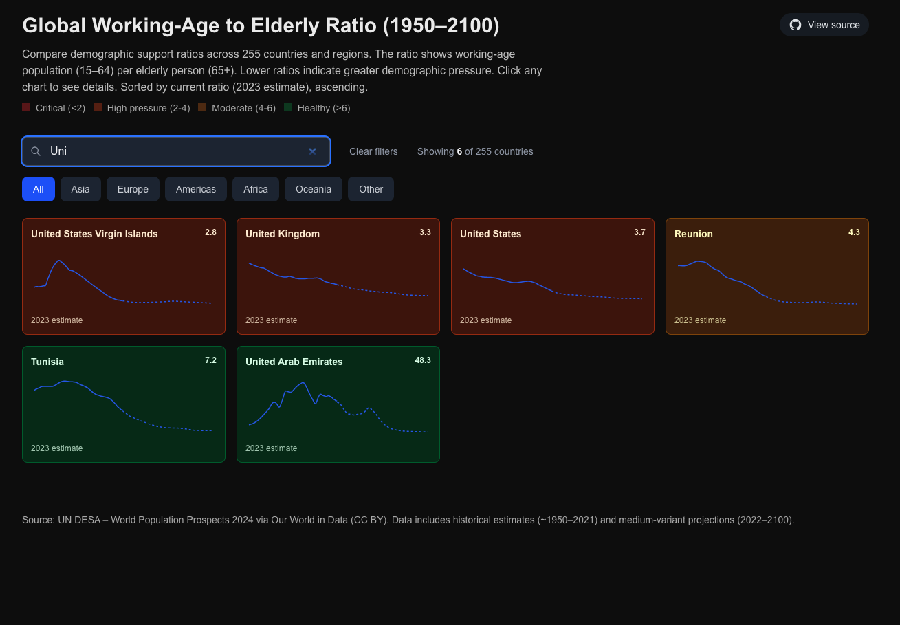

# Badges
[](https://opensource.org/licenses/MIT)
[](https://nextjs.org/)
 
[**Live demo**](#live-demo) · [**Screenshots**](#screenshots) 
# Working Age Ratio

A Next.js app that visualizes the "working-age to elderly" support ratio (people aged 15–64 per person aged 65+) across 100+ countries from 1950 to 2100. The project pulls estimates and UN medium-variant projections from Our World in Data and renders interactive charts so you can explore demographic pressure over time.

## Live Demo

[](https://working-age-ratio.vercel.app)

Open the live app: https://working-age-ratio.vercel.app

## Screenshots

### Home Page - All Countries Grid View

*Compare demographic trends across 100+ countries at a glance*

### Country Detail Page

*Interactive chart with historical estimates and UN projections*

### Search & Filter

*Find countries by name or filter by region*

> **Note**: To add screenshots, create a `screenshots/` folder in the repository root and add PNG images. You can capture these with your browser's screenshot tool or use `cmd+shift+4` on macOS.

## Key features

- Grid view of compact country charts for quick comparison
- Detail page per country with a full-size interactive chart (historical & projections)
- Dark mode friendly charts and tooltips
- File-based caching for the original OWID CSV to avoid Next.js fetch cache size limits
- Search and region filters with shareable URL state
- SEO-friendly metadata, sitemap and JSON-LD

Data source

This project uses the Our World in Data CSV derived from the UN World Population Prospects:

- https://ourworldindata.org/grapher/population-young-working-elderly-with-projections.csv

License: The underlying data is CC BY (Our World in Data / UN DESA). This repository code is provided under the license in this repository (check `LICENSE` if present).

Caching notes

The OWID CSV is ~2.3MB which exceeds Next.js' in-memory fetch cache limits. To work around this, the app implements a file-based cache using a small server-side cache file (local `.cache/owid-data.json` during development and `/tmp` on serverless platforms like Vercel) with a 24 hour TTL and React's `cache()` wrapper to deduplicate fetches.

Development

Install dependencies and run the dev server:

```bash
npm install
npm run dev
```

Open http://localhost:3000 to view the app.

Building for production

```bash
npm run build
npm run start
```

Deployment

This project is set up to deploy on Vercel. The file-based cache uses `/tmp` when running on serverless platforms; this keeps cached CSV data out of Next.js' in-memory cache and avoids the 2MB limit.

Contributing

The project is open source. Contributions, issues and pull requests are welcome — see the repository at:

https://github.com/orhan-swe/working-age-ratio

If you'd like help getting started, open an issue describing what you'd like to work on.

Contact

- Repository: https://github.com/orhan-swe/working-age-ratio

---

This README replaces the default template with a short project overview, data and caching notes, development instructions, and contributing pointer.
